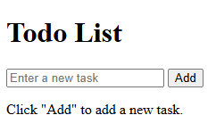
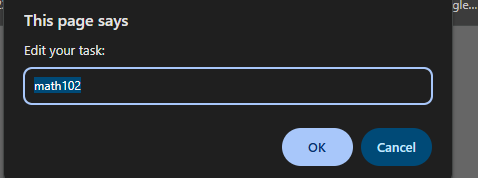

Todo List Application

 Description
This is a simple Todo List web application built using HTML and JavaScript  
It allows users to add, edit, and delete tasks easily.  
The project was created as part of a JavaScript learning activity.

---

 How to Run
1.  Open `index.html` in your browser.  
2.  Start adding your tasks!  
3. Click the "Edit" button to edit the task.
4. Click the "Remove" button to Remove the task.
---

 Main Page

 Editing Tasks

